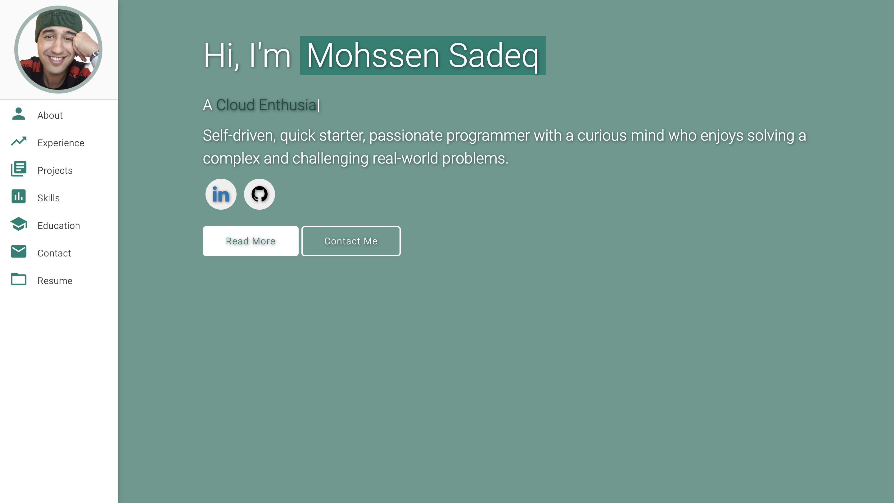

# Personal Portfolio  ⚡️ 
A clean, beautiful, responsive portfolio template for Software Developers!

### Website Preview

 
  <kbd>
    
  </kbd>

## Features 📋
⚡️ Fully Responsive\
⚡️ Valid HTML5 & CSS3\
⚡️ Typing animation using `Typed.js`\
⚡️ Easy to modify

## Installation & Deployment 📦
- Clone the repository and modify the content of <b>index.html</b> according to your requirement.
- Add or remove images from the `msadeq.de/assets/img/` directory as required.
- I highly recommend to use [Github Pages](https://create-react-app.dev/docs/deployment/#github-pages) to deploy the website the EASIEST WAY.
- To deploy your website, first, you need to create a GitHub repository with the name `<your-github-username>.github.io`. Please don't give any other name.
- Push the generated code to the `master` branch of this repository.
- <b>NOTE:</b> Make sure to set `analyticsId` from your Google Analytics account inside the Google Analytics script tag, if you want to use your own Google Analytics account.

## Sections 📚
✔️ About me\
✔️ Experience\
✔️ Projects \
✔️ Skills \
✔️ Education\
✔️ Contact Info\
✔️ Resume

To view a live example, **[click here](https://msadeq.de/)**

## Tools Used 🛠️
* [<b>AWS S3, CloudFront, and Route53</b>](https://aws.amazon.com/pm/serv-s3/?gclid=Cj0KCQjwhtWvBhD9ARIsAOP0GojE1XlVqxjHDy4KsuySbCwoUVS4PX3tEmoPYqVPZKyuR9jeFEQ9PuoaAvXXEALw_wcB&trk=518a7bef-5b4f-4462-ad55-80e5c177f12b&sc_channel=ps&ef_id=Cj0KCQjwhtWvBhD9ARIsAOP0GojE1XlVqxjHDy4KsuySbCwoUVS4PX3tEmoPYqVPZKyuR9jeFEQ9PuoaAvXXEALw_wcB:G:s&s_kwcid=AL!4422!3!645186213484!e!!g!!aws%20s3!19579892800!143689755565) - To host my static website (HTML, CSS, JS).
* [<b>Materialize</b>](https://materializecss.com/) - A CSS framework to get Google's Material Design components.
* [<b>Typed.js</b>](https://mattboldt.com/demos/typed-js/) - JavaScript Library

 As I mentioned in the Installation & Deployment section you can use Github pages to host it the easiest way

